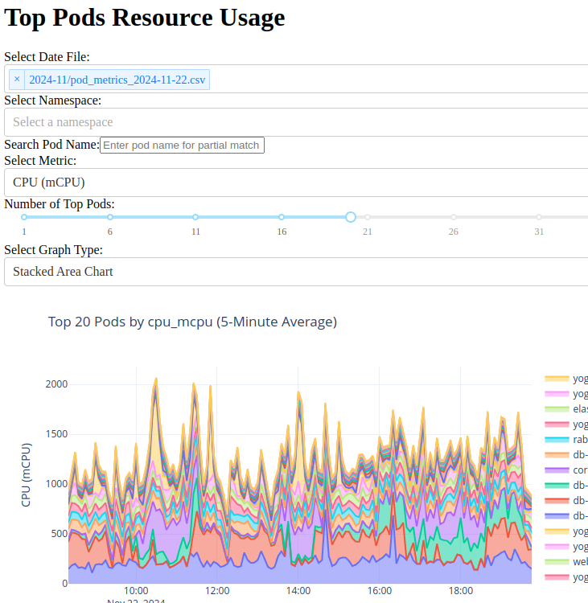

# description
This project is a simple monitoring for cpu / memory usage of your pods.

It's using no tools but **python** and **kube access**

it connects to your kube with the dump script and start do write some csvs

the graph script loads the csvs and graph the usage

Very handy ot have an overview of a ressource usage of a temporary kube cluster without having to install anything

# install

    python3 -m venv .
    souce ./bin/activate
    pip install -r requirements.txt

# launch

shell 1 (never quit this one)

    python dump4.py

shell 2 (can be launch only from time to time to read and graph)

    python graph_per_pod_interactive2.py

